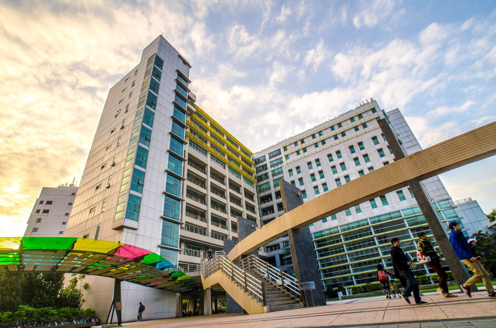
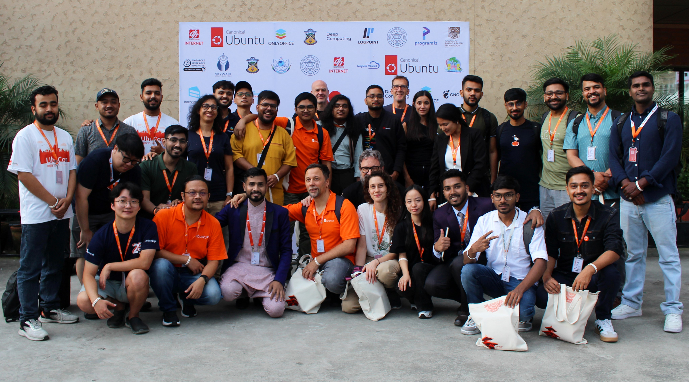
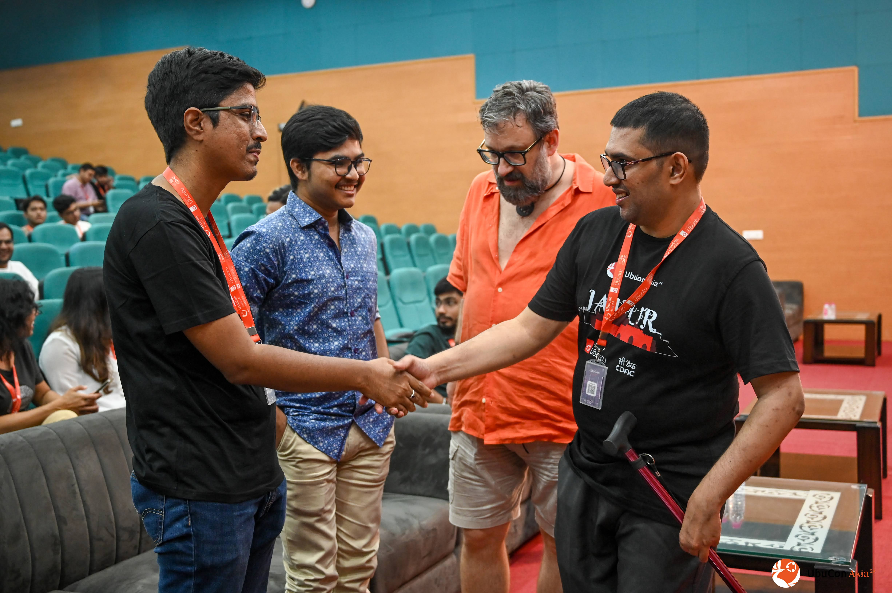
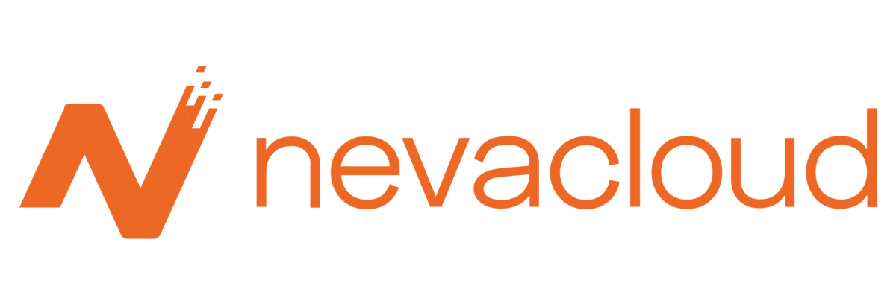
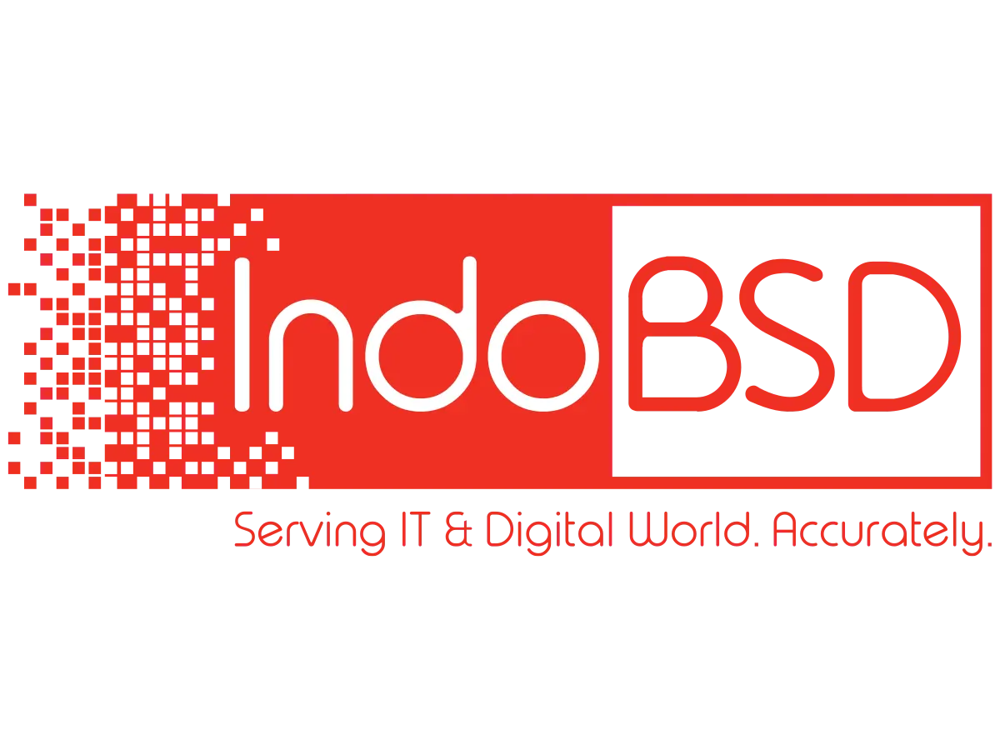
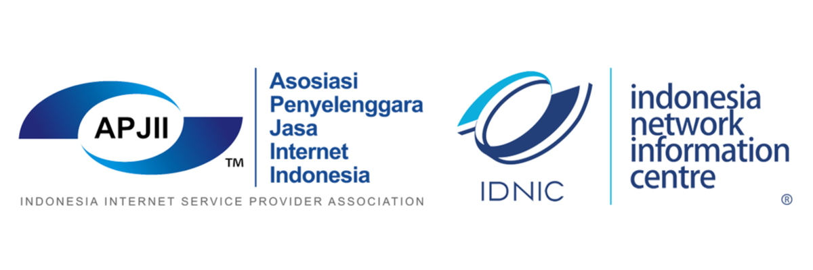

# UbuCon Asia 2026

August 8 - 9
National Taiwan University of Science and Technology
Taipei, Taiwan
**Sponsorship prospectus**

<!-- _paginate: skip -->

---

<!-- header:  -->
<!-- footer: https://2026.ubucon.asia | sponsorship@ubucon.asia -->

# About UbuCon Asia

**UbuCon(s) (Ubuntu Conference)** are non-profit events organized by Ubuntu Communities worldwide. These events bring together hundreds of Open Source enthusiasts, users, developers, and contributors to share their stories and experiences regarding **Ubuntu** and relevant free and open source technologies for **servers, desktops, cloud computing, IoT, robotics, data science, AI/ML, and much more.**

In the spirit of promoting the love of Ubuntu and Open Source, **UbuCon Asia,** one of the regional UbuCon events **focusing specifically on the Asian region,** is organized annually by Ubuntu Communities and other free and open source communities across Asia. Following the success of previous editions in Seoul (South Korea), Surakarta (Indonesia), Jaipur (India), and Kathmandu (Nepal), we are proud to announce that the **6th edition of UbuCon Asia** will be co-hosted with **COSCUP 2026** at the **National Taiwan University of Science and Technology (NTUST)** in Taipei, Taiwan.

As a non-profit event organized by volunteers without compensation or stable funding, we rely on sponsorships to host these events. Such events enable community members to learn, share, and grow together while meeting many of their peers in person, sometimes for the first time.

## Event overview

- **Event name:** UbuCon Asia 2026 @ COSCUP
- **Dates:** August 8th - 9th
- **Venue:** National Taiwan University of Science and Technology (NTUST), Taipei, Taiwan
- **Participant scale:** Around 300 or more
- **Organizer:** UbuCon Asia Committee

---

# The Ubuntu Project and Its Community

<!-- Text below are draft. You may improve it if you want -->

  
  
  

## Ubuntu

Ubuntu, co-developed by Ubuntu Community with people from worldwide and Canonical, stands as the world's leading open source linux based operating system. With its mission to bring free software to the widest audience while accelerating innovation and underpinning operations, Ubuntu powers millions of devices from personal computers to cloud infrastructure, serving as the foundation for technological advancement in AI, cloud computing, IoT, and enterprise solutions.

## Ubuntu Community

The Ubuntu community is an international network united by our name's meaning - "humanity towards others." With millions of users and thousands of contributors worldwide, we shape the future of computing through open collaboration and freely shared work. Our diverse community includes developers, engineers, system administrators, researchers, artists, writers, and more all working together to make technology accessible to everyone.

Our community thrives through:

- Active participation across Ubuntu Discourse, Launchpad, GitHub, Matrix chat and more
- Local Community (LoCo) teams advocating across regions
- Technical support and knowledge sharing on Ask Ubuntu and Ubuntu Forums
- Leadership opportunities through Ubuntu Membership and governance
- Commitment to our Code of Conduct and our mission

## UbuCon Asia

UbuCon Asia serves as the premier Ubuntu community event in the Asian region. By sponsoring UbuCon Asia, you're directly supporting Ubuntu's mission while connecting with a dynamic community that drives innovation across Asia and beyond.

---

# Host city & The venue

    

     
     
    

  

    <h2>Taiwan</h2>
    

    Taiwan is a vibrant island nation renowned for its thriving technology industry, world-class semiconductor manufacturing, rich cultural heritage, and warm hospitality. As one of Asia's leading tech hubs, Taiwan is home to global leaders in computing, cloud, and open-source ecosystems, making it an ideal destination for a FOSS focused international conference.
    

    <h2>Taipei</h2>
    

    Taipei is Taiwan's dynamic capital and a global technology center, home to major tech corporations, a thriving startup scene, and a deeply embedded open-source culture. The city offers an ideal blend of modern infrastructure, outstanding cuisine, and excellent connectivity for international travelers.
    

  

    

    
    

  

    <h2>National Taiwan University of Science and Technology </h2>
    

    <b>NTUST</b> is one of Taiwan's leading technology universities, located in central Taipei. Its state-of-the-art academic facilities provide an excellent environment for a community driven open-source conference, with large auditoriums, classroom spaces, and exhibition areas.
    

  

---

# Who attends UbuCon Asia

| Category                  | Roles                                                                                     |
|---------------------------|-------------------------------------------------------------------------------------------|
| **Software Engineers**    | System, Application (Web, Desktop, etc.), Embedded (IoT, Robotics), Kernel & OS           |
| **IT Infra & Operations** | SRE, SysAdmins, Solution Architects, DevOps, Cloud Engineers                              |
| **Data & AI**             | Data Engineers, Data Scientists, DBA, AI/ML Engineers                                     |
| **Community & Leadership**| Community Managers, DevRel, Technical Managers, OSPO Teams                                |
| **Academic & Other**      | Students (IT majors), Professors, Researchers, Analysts, Entrepreneurs, Media             |

## Highlights from last year
UbuCon Asia 2025 was the **largest and most diverse edition** in the conference's history.

  
<b>Total ~450</b> Participants

  
Participants from  <b>14+ countries</b>

  
Session proposals <b>73 received</b>

  
<b>40 Speakers</b>  in total

  
<b>~40% Attendees</b> with career

### Participants demographics
<pre class="mermaid mermaid-100h">
pie 	
    "Entrepreneur": 9
    "IT Infra & Operations": 49
    "Other": 49
    "Scientist": 15
    "Software Engineers": 67
    "Specialized Roles (CM/AI/Data)": 36
    "Student":	225
</pre>

---
### Demographics breakdown - Software Engineers
<pre class="mermaid mermaid-100h" style="height: 40%">
pie 
    "Backend":	8
    "Fullstack":	5
    "Web":	5
    "Embedded":	3
    "Frontend":	2
    "Other":	44
</pre>

### Demographics breakdown - IT Infra & Operations
<pre class="mermaid mermaid-100h"  style="height: 40%">
pie 
    "DevOps Engineer":	19
    "System Engineer":	6
    "Cloud Engineer":	5
    "IT Operation":	5
    "Network Engineer":	4
    "Support Engineer":	3
    "Security Engineer":	3
    "Other": 4
</pre>
---

# Become a sponsor!

UbuCon Asia, although being a new addition to the UbuCon events, has already been organized in Seoul(South Korea), Surakarta(Indonesia), Jaipur(India), and Kathmandu(Nepal) with many success. It has been a momentum to drive making local Ubuntu communities active or revive and connect with each other. The event is solely organized by community and volunteer efforts without any financial compensation. Thus, we rely solely on our sponsors to fund our various expenses and make the event successful.

Ubuntu is more than just an open-source platform; it embodies a global community committed to diversity, collaboration, and empowerment. UbuCon Asia is a unique opportunity to engage with passionate technology professionals across the Asia. Sponsoring this event will connect you with top Ubuntu developers, contributors, and innovators from diverse Asian communities, gaining insights into the region's vibrant tech ecosystem. Your support will help foster technological exchange and community growth across Asia and beyond.

## Benefits of Sponsorship

  

  

     
    <b>Targeted marketing opportunities</b> 
    A good opportunity to boost leads through targeted marketing with most of our audience from tech industry.
  

  

     
    <b>Talent acquisition</b> 
    Recruit the brightest minds in the industry to fill your open positions.
    40%+ of our attendees last year were with IT related professions. 
  

  

     
    <b>Empower your branding</b> 
    Expose your logo on banners, website, videos and more places to empower your branding and awareness.
  

  

     
    <b>Mindshare Capture from Developers and Advocates</b> 
    Position your brand as a key player and a thought leader among influential technical professionals.
  

  

  

  

     
    <b>Showcase products and services</b> 
    Showcase your innovative products and service face-to-face with your potential and existing customers and receive valuable feedback. 
  

  

     
    <b>Establish thought leadership</b> 
    Showcase your expertise on Ubuntu and its ecosystem and educate the community about your organization’s products, services and open source strategies.
  

  

     
    <b>Support Open source and Community</b> 
    Sponsoring our event is one of the best ways to show your sincere and support to open source and community.
  

  

     
    <b>Media Exposure and PR Announcements</b> 
    Generate strategic media coverage and amplify brand messaging beyond the event.
  

  

**By sponsoring UbuCon Asia, you get to reach a diverse and varied audience 
of Ubuntu and open source practitioners, all in one place.**

---

# Past sponsors

  
  
  

  
  
  

  
  
  

  
  
  

  
  
  

  
  
  

  
  
  

---

# Sponsorship packages
| Package  | Price (USD) | Official website and OPass app          | Event Site (co-branded with COSCUP)   | COSCUP social media   |
| -------- | ----------- | --------------------------------------- | ------------------------------------- | --------------------- |
| Titanium | 8,500       | Company profile listed; agenda page ads | Logo displayed at the \*1; \*2; \*3; \*4; \*5; \*6  | 1 article on the COSCUP blog; promotion via COSCUP social media |
| Diamond  | 6,090       | Company profile listed; agenda page ads | Logo displayed at the \*1; \*3; \*5   | 1 article on the COSCUP blog; promotion via COSCUP social media |
| Gold     | 4,910       | Company profile listed; agenda page ads | Logo displayed at the \*1; \*3        | 1 article on the COSCUP blog; promotion via COSCUP social media |
| Silver   | 2,945       | Company profile listed; agenda page ads | Logo displayed at the \*1             | Promotion via COSCUP social media                               |
| Bronze   | 1,375       | Company profile listed; agenda page ads | Logo displayed at the \*1             | Promotion via COSCUP social media                               |
| Friend   | 785         | Company profile listed                  | Logo displayed at the \*1             | Promotion via COSCUP social media                               |

| Additional purchase                 | Titanium | Diamond  | Gold   | Silver | Bronze | Friend |
| ----------------------------------- | -------- | -------- | ------ | ------ | ------ | ------ |
| Booth                               | 2,950    | 2,160    | 980    | X      | X      | X      |
| Main Track, 30 mins                 | 1,608    | 1,608    | X      | X      | X      | X      |
| Technical Talk, 30 mins             | 1,608    | 1,608    | 1,608  | X      | X      | X      |
| Workshop, 2 hrs                     | 983      | 983      | 983    | X      | X      | X      |
| Logo on stage flag in keynote hall  | Included | 3,930    | X      | X      | X      | X      |
| Lanyards                            | 3,140    | 3,140    | 3,140  | X      | X      | X      |
| Welcome Party Sponsorship           | Included | 5,890    | 5,890  | X      | X      | X      |
| Promotion at the snack area, 2 days | Included | Included | 1,180  | 1,180  | 1,180  | 1,180  |
| Agenda page ads                     | 470/ad   | 470/ad   | 470/ad | 470/ad | 470/ad | 470/ad |

### Notes

- Sponsorship prices are in USD, and the final sponsor fee will be converted using the exchange rate applied at payment time. The page uses 1 USD = 28 TWD as the reference example.
- Agenda page ads are available for all sponsorship levels, and the ad frequency depends on the sponsorship level.
- Booths are available only for Gold, Diamond, and Titanium sponsors.
- The sponsorship deadline is July 06, 2026.
- COSCUP does not provide attendee personal information to sponsors.
- If sponsorship benefits are not used within the year, they are considered relinquished and are non-refundable.

### Footnotes

- \*0: reception table
- \*1: logo on stage flag in keynote hall
- \*2: Welcome party sponsorship
- \*3: Welcome party free drink tickets
- \*4: Recruiting Board Sponsorship
- \*5: Promotion at the snack area
- \*6: Brand exposure on the conference table-front display

Refer to next page for additional sponsorship opportunities.

---

# Sponsorship packages

## Additional sponsorship opportunities

Additional sponsorship opportunities are available, including booth purchases, sponsored talks, workshops, stage flag branding, lanyards, Welcome Party sponsorship, snack area promotion, and agenda page ads.

If the standard sponsorship packages do not fit the sponsor's budget or goals, customized sponsorship arrangements may also be discussed.

If there are no sponsorship packages that fits your budget and needs, We're also open to discuss adjust existing package or designing package tailored for you.

Please contact us at [sponsorship@ubucon.asia](mailto:sponsorship@ubucon.asia) to discuss such opportunities!

---

# End of Document

Thank you for consider sponsoring our event.
For inquires and securing sponsorship,
Contact sponsorship team at sponsorship@ubucon.asia

More details on this event can be found at
https://2026.ubucon.asia

<!-- _paginate: skip -->
<!-- footer: false -->
